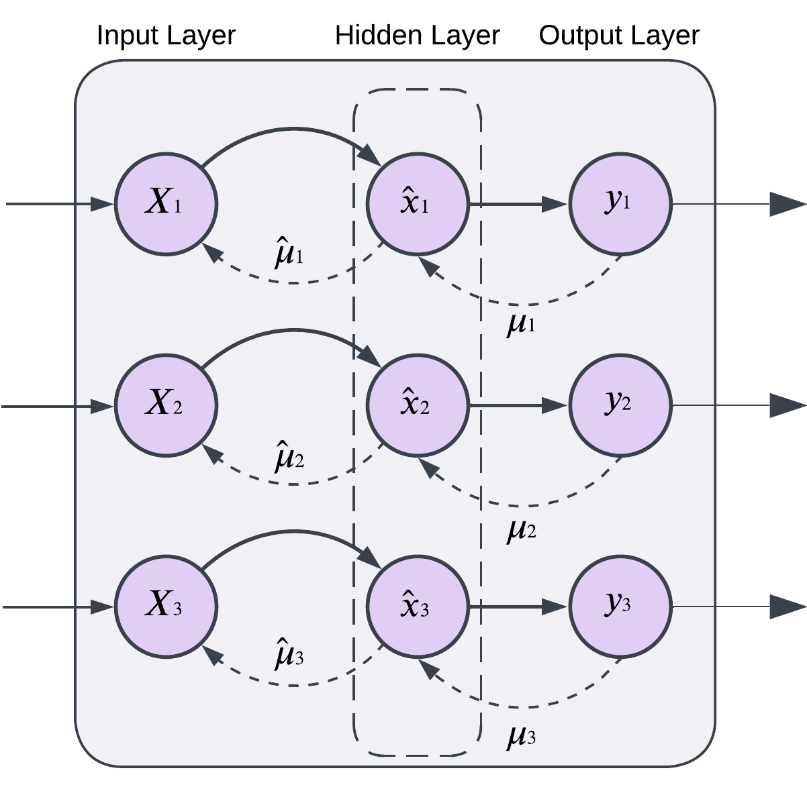

# Predictive Coding and Hebbian Learning Architectures

This repository contains implementations of Predictive Coding (PC) layers, Hebbian learning mechanisms, and their hybrid combinations. The models are evaluated on the MNIST dataset under varying noise levels to compare their convergence speed and robustness.

## Architectures

### Predictive Coding (PC) Layer
The PC Layer minimizes a predictive error between a latent variable (x) and its predicted state (μ). This energy minimization drives learning and adaptation.

### Hebbian Layer
Hebbian learning follows the principle of "neurons that fire together, wire together," strengthening connections between neurons based on their correlation.

### Hybrid Architecture
The hybrid model combines Hebbian and PC layers to leverage both local learning (Hebbian) and global energy minimization (PC).
## Architecture Diagram

The following diagram illustrates the architecture of the Predictive Coding (PC) Layer:



- **Input Layer**: Initial input to the network.
- **Hidden Layer**: Contains the latent variables (\( \hat{x} \)) and their connections with the predictions (\( \mu \)).
- **Output Layer**: Outputs (\( y \)) generated based on the computations from the previous layers.

This architecture highlights how predictive coding integrates feedback (\( \mu \)) and latent variables (\( \hat{x} \)) to minimize prediction error.
---

## Analysis of Architectures on Noisy MNIST

### Speed of Convergence:
- **PC-Only**: Fastest convergence, especially at low noise levels (0%-20%). Substantial improvements by epoch 5.
- **Hebb-Only**: Slower initial learning but stable progression, particularly robust at higher noise levels.
- **Hybrid**: Good convergence speed under medium noise levels, though collapsed at high noise percentages (e.g., 50%).

### Accuracy Across Noise Levels:
- **Low Noise (0%-20%)**:
  - PC-Only performs the best with slightly higher accuracy than others.
  - Hybrid performs well but slightly behind PC-Only.
  - Hebb-Only lags in low-noise conditions.
- **Medium Noise (30%-40%)**:
  - Hybrid architecture excels, maintaining accuracy as noise increases.
  - PC-Only shows a noticeable drop compared to Hybrid.
  - Hebb-Only starts closing the gap with PC-Only.
- **High Noise (50%)**:
  - Hebb-Only demonstrates robustness and adaptability, outperforming PC-Only.
  - Hybrid collapses at high noise but performs well in lower noise conditions.

### Summary:
- **Best Accuracy at Low Noise**: PC-Only.
- **Best Accuracy at High Noise**: Hebb-Only.
- **Hybrid Model**: Promising performance under moderate noise but requires additional considerations for high-noise scenarios.

---

## Results Visualization
The results include test accuracy curves for all architectures under different noise levels. Epoch scaling and interpolation techniques ensure smooth and interpretable plots.

### Key Features:
- Wide scaling for epochs 0-20 for better visualization of early learning.
- Shrinked scaling for higher epochs to maintain clarity.
- Smooth interpolation for accuracy trends with raw data points shown at 20% opacity.

---

## Clone and Usage

Clone this repository:
```bash
git clone https://github.com/Arashkhajooei/Predictive-Coding/
